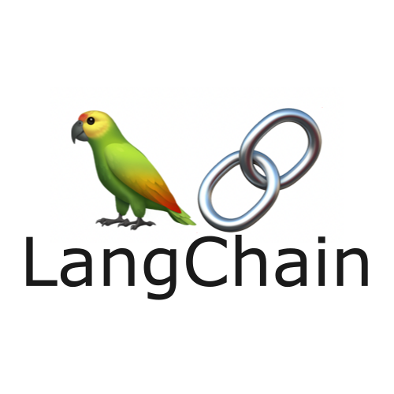

# ice-breaker

<!-- Improved compatibility of back to top link: See: https://github.com/othneildrew/Best-README-Template/pull/73 -->
<a name="readme-top"></a>

<!-- PROJECT SHIELDS -->
<!--
*** Markdown "reference style" links for readability.
*** Reference links are enclosed in brackets [ ] instead of parentheses ( ).
-->


<!-- PROJECT LOGO -->
<br />
<div align="center">
  <a href="https://github.com/othneildrew/Best-README-Template">
    
  </a>

<h3 align="center">LLM IceBreaker</h3>

  <p align="center">
    LLM IceBreaker with a Flask web application
    <br />
    <a href="https://github.com/jpcadena/ice-breaker"><strong>Explore the docs
»</strong></a>
    <br />
  </p>
</div>


<!-- TABLE OF CONTENTS -->
<details>
  <summary>Table of Contents</summary>
  <ol>
       <li>
      <a href="#about-the-project">About The Project</a>
      <ul>
        <li><a href="#built-with">Built With</a></li>
      </ul>
    </li>
    <li>
      <a href="#getting-started">Getting Started</a>
      <ul>
        <li><a href="#prerequisites">Prerequisites</a></li>
        <li><a href="#installation">Installation</a></li>
      </ul>
    </li>
    <li><a href="#usage">Usage</a></li>
    <li><a href="#contributing">Contributing</a></li>
    <li><a href="#security">Security</a></li>
    <li><a href="#code-of-conduct">Code of Conduct</a></li>
    <li><a href="#license">License</a></li>
    <li><a href="#contact">Contact</a></li>  </ol>
</details>


<!-- ABOUT THE PROJECT -->

## About The Project

![Project][project-screenshot]

IceBreaker is a Flask-powered web application that harnesses the power of LangChain and OpenAI's Large Language Models (LLM) to create engaging and personalized IceBreaker strategies. By integrating with social media APIs such as Google Search, Twitter, and LinkedIn, IceBreaker offers a unique approach to connecting with people online, leveraging the advanced capabilities of ChatGPT for intelligent, context-aware interactions.

<p align="right">(<a href="#readme-top">back to top</a>)</p>

### Built with

[![Python][python-shield]][python-url] [![Flask][flask-shield]][flask-url] [![Pydantic][pydantic-shield]][pydantic-url] [![OpenAI][openai-shield]][openai-url] [![Google][google-shield]][google-url][![Twitter][twitter-shield]][twitter-url] [![LinkedIn][linkedin-shield]][linkedin-homepage][![HTML5][html5-shield]][html5-url] [![CSS3][css3-shield]][css3-url] [![isort][isort-shield]][isort-url] [![Black][black-shield]][black-url] [![Ruff][ruff-shield]][ruff-url] [![MyPy][mypy-shield]][mypy-url] [![pre-commit][pre-commit-shield]][pre-commit-url] [![GitHub Actions][github-actions-shield]][github-actions-url] [![Poetry][poetry-shield]][poetry-url] [![Pycharm][pycharm-shield]][pycharm-url] [![Visual Studio Code][visual-studio-code-shield]][visual-studio-code-url] [![License: MIT][license-shield]][license-url]

### Components

- **Flask Backend**: Serves as the backbone of the application, handling HTTP requests, API interactions, and serving dynamic content using Jinja2 templating.

- **LangChain with OpenAI LLM**: Utilizes advanced language models for generating personalized and contextually relevant IceBreaker suggestions.

- **Social Media Integration**: Leverages APIs from Google Search, Twitter, and LinkedIn to gather insights and tailor conversations effectively.

- **Frontend**: Built with HTML and CSS, providing a user-friendly interface for interaction.

This application stands out by combining cutting-edge AI with practical social media insights, offering a novel way to break the ice in digital communications.

<p align="right">(<a href="#readme-top">back to top</a>)</p>


<!-- GETTING STARTED -->

## Getting started

### Prerequisites

- [Python 3.11][python-docs]

### Installation

1. Clone the **repository**
   ```
   git clone https://github.com/jpcadena/ice-breaker.git
   ```
2. Change the directory to **root project**
   ```
   cd ice-breaker
   ```
3. Install **Poetry** package manager
   ```
   pip install poetry
   ```
4. Install the project's **dependencies**
   ```
   poetry install
   ```
5. Activate the **environment**
   ```
   poetry shell
   ```

<p align="right">(<a href="#readme-top">back to top</a>)</p>


<!-- USAGE EXAMPLES -->

## Usage

1. **Setting up environment variables:**

   If you find a `.env.sample` in the project directory, make a copy of it and rename to `.env`.

   ```
   cp .env.sample .env
   ```

   This `.env` file will be used to manage your application's environment variables.


2. **Configuring your credentials:**

   Open the `.env` file in a text editor and replace the placeholder values with your actual credentials.
   ```
   # .env file
   TWITTER_API_KEY=your_x_api_key
   OPENAI_API_KEY=your_openai_api_key
   ```
   Be sure to save the file after making these changes.


3. **Starting the WSGI server:**

   To start the local server on your machine, run the following command in your terminal:

   ```
   flask run --debug
   ```

   The `--debug` flag enables debug mode and hot reloading, which means the
   server will automatically update whenever you make changes to the code.


4. **Interacting with the app:**

   Once your server is running, you can interact with it using the
   Javascript client at your web browser at `http://localhost:5000`.


<p align="right">(<a href="#readme-top">back to top</a>)</p>


<!-- CONTRIBUTING -->

## Contributing

[![GitHub][github-shield]][github-url]

Please read our [contributing guide](CONTRIBUTING.md) for details on our code of conduct, and the process for submitting pull requests to us.

<p align="right">(<a href="#readme-top">back to top</a>)</p>

<!-- SECURITY -->

## Security

For security considerations and best practices, please refer to our [Security Guide](SECURITY.md) for a detailed guide.

<p align="right">(<a href="#readme-top">back to top</a>)</p>

<!-- CODE_OF_CONDUCT -->

## Code of Conduct

We enforce a code of conduct for all maintainers and contributors. Please read our [Code of Conduct](CODE_OF_CONDUCT.md) to understand the expectations before making any contributions.

<p align="right">(<a href="#readme-top">back to top</a>)</p>

<!-- LICENSE -->

## License

Distributed under the MIT License. See [LICENSE](LICENSE) for more information.

<p align="right">(<a href="#readme-top">back to top</a>)</p>

<!-- CONTACT -->

## Contact

- [![LinkedIn][linkedin-shield]][linkedin-url]

- [![Outlook][outlook-shield]](mailto:jpcadena@espol.edu.ec?subject=[GitHub]ice-breaker)

<p align="right">(<a href="#readme-top">back to top</a>)</p>

<!-- MARKDOWN LINKS & IMAGES -->
<!-- https://www.markdownguide.org/basic-syntax/#reference-style-links -->

[project-screenshot]: static/banner.png
[python-docs]: https://docs.python.org/3.11/

[linkedin-shield]: https://img.shields.io/badge/linkedin-%230077B5.svg?style=for-the-badge&logo=linkedin&logoColor=white
[outlook-shield]: https://img.shields.io/badge/Microsoft_Outlook-0078D4?style=for-the-badge&logo=microsoft-outlook&logoColor=white
[python-shield]: https://img.shields.io/badge/python-3670A0?style=for-the-badge&logo=python&logoColor=ffdd54
[flask-shield]: https://img.shields.io/badge/flask-%23000.svg?style=for-the-badge&logo=flask&logoColor=white
[pydantic-shield]: https://img.shields.io/badge/Pydantic-FF43A1?style=for-the-badge&logo=pydantic&logoColor=white
[openai-shield]: https://img.shields.io/badge/chatGPT-74aa9c?style=for-the-badge&logo=openai&logoColor=white
[html5-shield]: https://img.shields.io/badge/HTML5-E34F26?style=for-the-badge&logo=html5&logoColor=white
[pycharm-shield]: https://img.shields.io/badge/PyCharm-21D789?style=for-the-badge&logo=pycharm&logoColor=white
[github-shield]: https://img.shields.io/badge/github-%23121011.svg?style=for-the-badge&logo=github&logoColor=white
[ruff-shield]: https://img.shields.io/endpoint?url=https://raw.githubusercontent.com/charliermarsh/ruff/main/assets/badge/v1.json
[black-shield]: https://img.shields.io/badge/code%20style-black-000000.svg?style=for-the-badge&logo=appveyor
[mypy-shield]: https://img.shields.io/badge/mypy-checked-2A6DB2.svg?style=for-the-badge&logo=appveyor
[visual-studio-code-shield]: https://img.shields.io/badge/Visual_Studio_Code-007ACC?style=for-the-badge&logo=visual-studio-code&logoColor=white
[poetry-shield]: https://img.shields.io/endpoint?url=https://raw.githubusercontent.com/python-poetry/website/main/static/badge/v0.json
[isort-shield]: https://img.shields.io/badge/%20imports-isort-%231674b1?style=flat&labelColor=ef8336
[github-actions-shield]: https://img.shields.io/badge/github%20actions-%232671E5.svg?style=for-the-badge&logo=githubactions&logoColor=white
[pre-commit-shield]: https://img.shields.io/badge/pre--commit-F7B93E?style=for-the-badge&logo=pre-commit&logoColor=white
[css3-shield]: https://img.shields.io/badge/CSS3-1572B6?style=for-the-badge&logo=css3&logoColor=white
[license-shield]: https://img.shields.io/badge/License-MIT-yellow.svg
[google-shield]: https://img.shields.io/badge/google-4285F4?style=for-the-badge&logo=google&logoColor=white
[twitter-shield]: https://img.shields.io/badge/Twitter-%231DA1F2.svg?style=for-the-badge&logo=Twitter&logoColor=white

[linkedin-url]: https://linkedin.com/in/juanpablocadenaaguilar
[linkedin-homepage]: https://linkedin.com
[python-url]: https://docs.python.org/3.11/
[python-url]: https://www.python.org/
[flask-url]: https://palletsprojects.com/p/flask/
[pydantic-url]: https://docs.pydantic.dev
[openai-url]: https://openai.com/
[html5-url]: https://developer.mozilla.org/en-US/docs/Glossary/HTML5
[pycharm-url]: https://www.jetbrains.com/pycharm/
[github-url]: https://github.com/jpcadena/ice-breaker
[ruff-url]: https://beta.ruff.rs/docs/
[black-url]: https://github.com/psf/black
[mypy-url]: http://mypy-lang.org/
[visual-studio-code-url]: https://code.visualstudio.com/
[poetry-url]: https://python-poetry.org/
[isort-url]: https://pycqa.github.io/isort/
[github-actions-url]: https://github.com/features/actions
[pre-commit-url]: https://pre-commit.com/
[css3-url]: https://developer.mozilla.org/en-US/docs/Web/CSS
[license-url]: https://opensource.org/licenses/MIT
[google-url]: https://www.google.com/
[twitter-url]: https://twitter.com/
